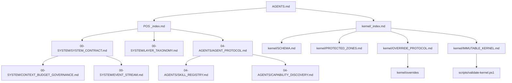

# Kernel Dependency Graph

Mapeia as dependências entre os arquivos do kernel para análise de blast radius em caso de mudanças.

## Nodes (arquivos)

### IMMUTABLE

- `AGENTS.md` (root kernel)
- `00-SYSTEM/SYSTEM_CONTRACT.md`
- `00-SYSTEM/CONTEXT_BUDGET_GOVERNANCE.md`
- `00-SYSTEM/EVENT_STREAM.md`
- `00-SYSTEM/LAYER_TAXONOMY.md`
- `kernel/SCHEMA.md`
- `kernel/PROTECTED_ZONES.md`
- `kernel/OVERRIDE_PROTOCOL.md`
- `kernel/IMMUTABLE_KERNEL.md`

### PROTECTED

- `docs/obsidian/project-operating-system/_index.md` (POS router)
- `04-AGENTS/_index.md`
- `04-AGENTS/SKILL_REGISTRY.md`
- `04-AGENTS/AGENT_PROTOCOL.md`
- `04-AGENTS/CAPABILITY_DISCOVERY.md`
- `04-AGENTS/ACTIVE_RUNTIME_CONTEXT.md`

## Edges (dependências)

## Criticality Classification

- **HIGH**: arquivos IMMUTABLE. Alteração quebra invariantes.
- **MEDIUM**: arquivos PROTECTED. Exigem validação reforçada.
- **LOW**: arquivos OPERATIONAL/EPHEMERAL.

## Blast Radius Estimation Tools

- `validate-kernel.ps1 --dependencies <file>` — lista arquivos que dependem do alvo.
- `pos-test-all.ps1` — valida coesão geral.

## Notas

- Dependências são extraídas de links markdown e referênciasimplícitas.
- Arquivos com `immutable: true` devem ter dependências mínimas para reduzir blast radius.
