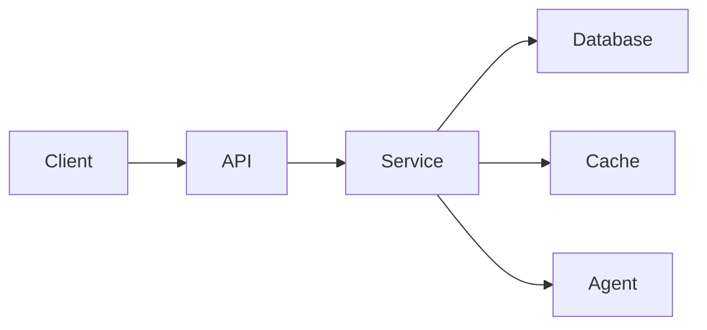

---
type: guide
status: template
domain: architecture
layer: L2
semantic_priority: 4
tags:
  - type/guide
  - domain/architecture
  - tech/data-flow
  - lifecycle/template
  - retrieval_domain/architecture
  - context_temperature/warm
created_at: 2026-05-26
updated_at: 2026-05-26
---

# DATA_FLOW — Fluxos de Dados

Template para fluxos de dados críticos do sistema.

## Fluxos Principais

### Request Flow

### Retrieval Flow

## Relações

- [[_index|02-ARCHITECTURE Index]]
- [[SECURITY_RUNTIME]] — Security boundaries